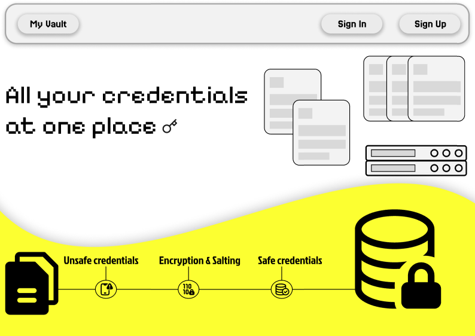
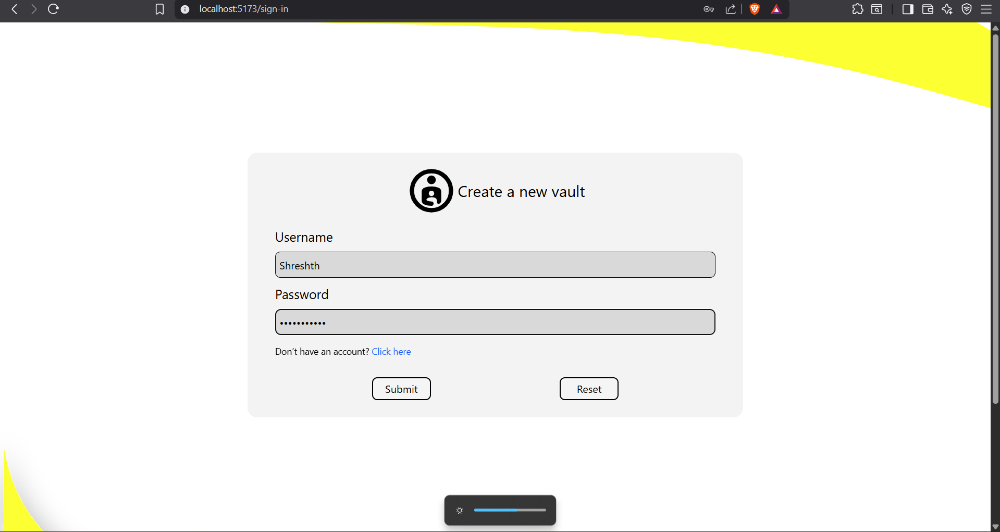
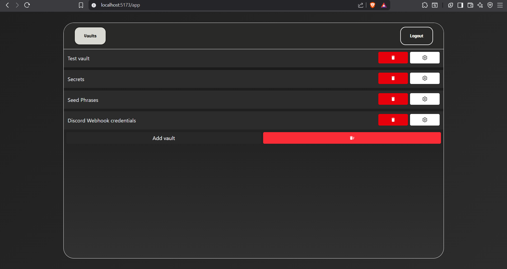
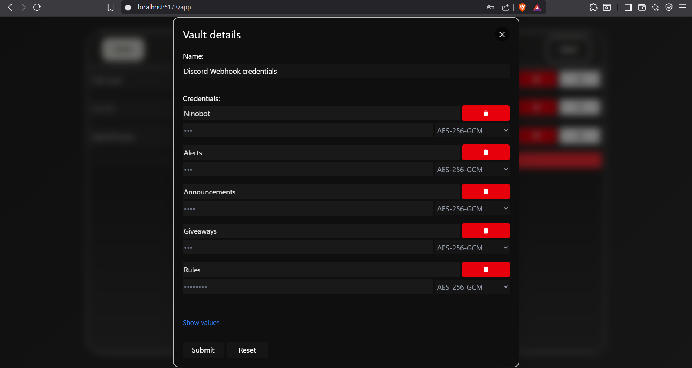
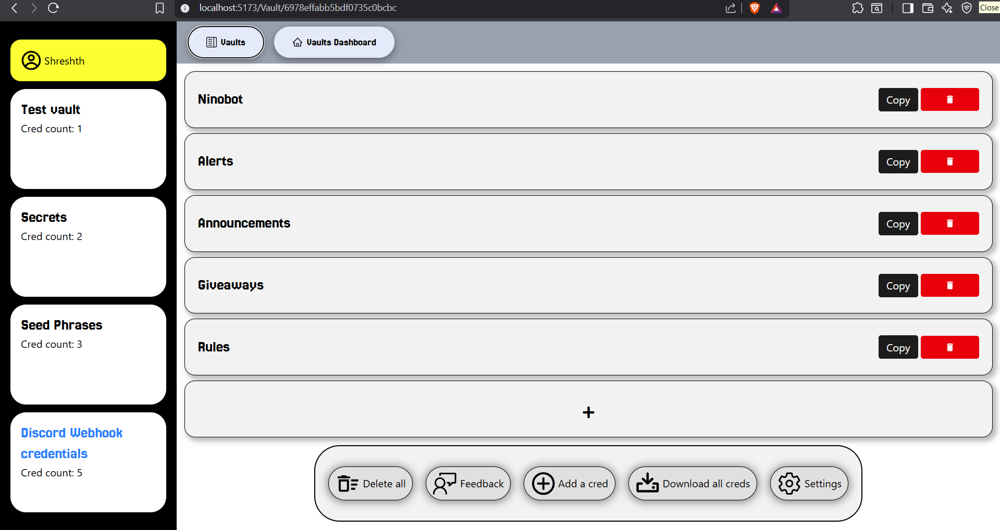

##Fuhgedd about it - A security aware credential workspace

#Implication:
The name implies that just give in your credentials to us as we attempt to provide a one stop solution for the security of your credentials. This Web-app provides currently provides a number of symmetric encryption algorithms so that you can choose for your credentials as per your convenience and priorities.

#Things to be rolled on in the next version of it:
<ol>
    <li>
        Central dashboard to let you monitor the strenght of your vaults and credentials
    </li>
    <li>
        Setting feature for vaults and credentials
    </li>
    <li>
        In-app documentation to educate all kind of users on how Cryptography and encryption algorithms work
    </li>
    <li>
        PQC algorithms (if needed)
    </li>
    <li>
        Feature to download
    </li>
</ol>

 
##A short and crisp walkthrough of my V1:

<h3>Homepage:</h3>

To onboard users to my web-app

 

<h3>Sign-in page:</h3>

 

<h3>Vaults dashboard:</h3>

 

<h3>Vault creation dialog box:</h3>

 

<h3>Credential dashboard:</h3>
